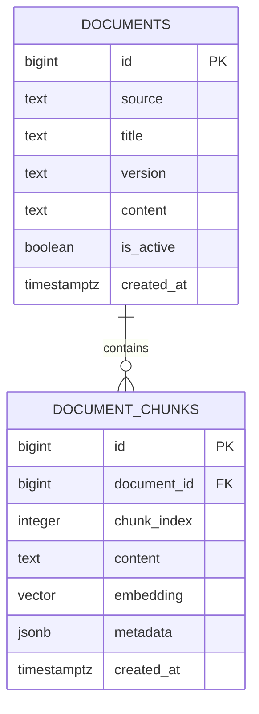

# Initial database ER diagram

`DOCUMENTS` stores the original source. `DOCUMENT_CHUNKS` stores the smaller pieces used for semantic search. Each chunk has its own embedding because the RAG query retrieves relevant chunks, not entire documents.
