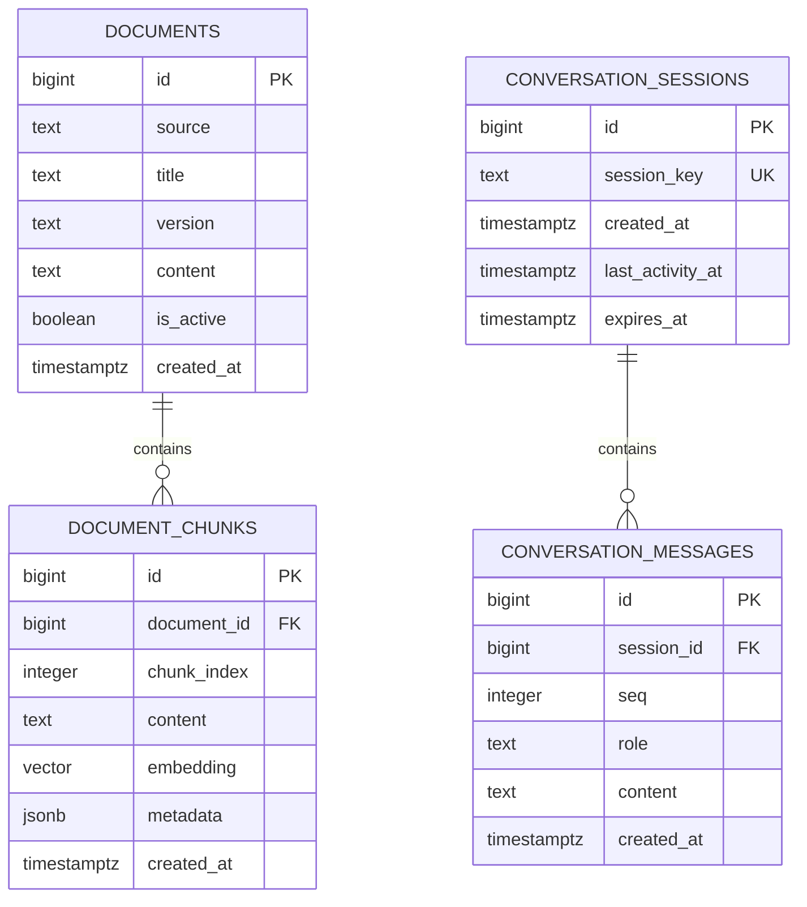

# Initial database ER diagram

```mermaid
erDiagram
    DOCUMENTS {
        bigint id PK
        text source
        text title
        text version
        text content
        boolean is_active
        timestamptz created_at
    }

    DOCUMENT_CHUNKS {
        bigint id PK
        bigint document_id FK
        integer chunk_index
        text content
        vector embedding
        jsonb metadata
        timestamptz created_at
    }

    DOCUMENTS ||--o{ DOCUMENT_CHUNKS : contains

    CONVERSATION_SESSIONS {
        bigint id PK
        text session_key UK
        timestamptz created_at
        timestamptz last_activity_at
        timestamptz expires_at
    }

    CONVERSATION_MESSAGES {
        bigint id PK
        bigint session_id FK
        integer seq
        text role
        text content
        timestamptz created_at
    }

    CONVERSATION_SESSIONS ||--o{ CONVERSATION_MESSAGES : contains
```

`DOCUMENTS` stores the original source. `DOCUMENT_CHUNKS` stores the smaller pieces used for semantic search. Each chunk has its own embedding because the RAG query retrieves relevant chunks, not entire documents.

`CONVERSATION_SESSIONS` stores temporary conversation sessions. `session_key`
is intended to contain an application-derived HMAC, not the original IP.
`CONVERSATION_MESSAGES` stores ordered user and assistant messages. Deleting a
session deletes its messages through `ON DELETE CASCADE`; expiration cleanup is
performed by the application or a future purge job.
